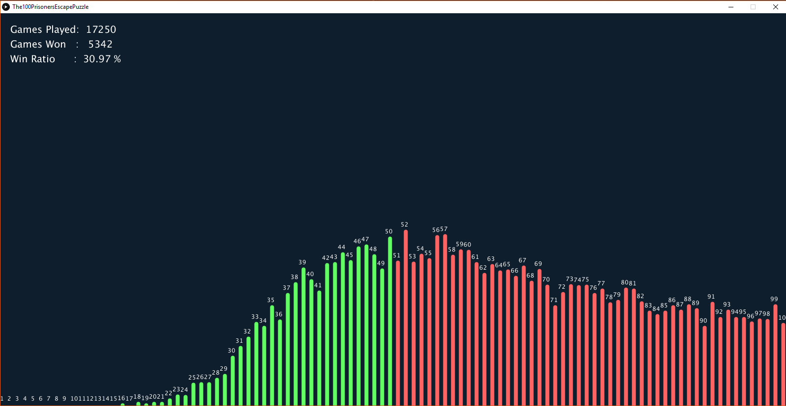

# The100PrisonersEscapePuzzle

This is a processing visualization of the 100 Prisoners Escape Puzzle.

#### Screen Shot

  

#### About:
Prisoners are numbered 0-99 and their numbers are randomly randomly added to the 100 boxes.  
Each prisoner starts by picking the box of their own number.  
If they don't find their own number inside they pick the box with the number that was found.  
This repeats until they find their own number.  
When a prisoner finds themself, then a loop is formed 
(because their number would point back the to box they first picked).  

The game is won if the longest loop contains 50 or less opened boxes, 
hence all prisoners found their own number by opening 50 or less boxes.  

The diagram shows a counter of the longest loop in each game.  

It is expected that "31.18% of the time, the length of the maximum chains formed will 
be less than 50 boxes and so every prisoner will be able to find his ticket before hitting the 50 box limit." 
(http://datagenetics.com/blog/december42014/index.html)

#### Rules
- 100 Prisoners Escape Puzzle
- http://datagenetics.com/blog/december42014/index.html
  
#### Inspiration
 - The Demonetization Game
 - https://www.youtube.com/watch?v=kOnEEeHZp94
